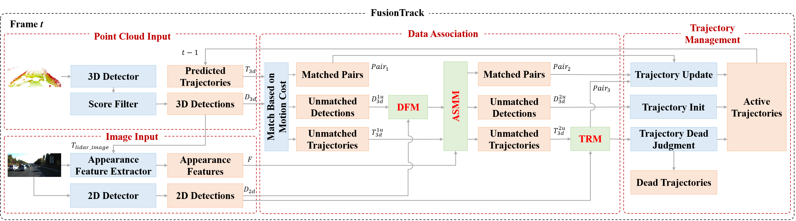

# FusionTrack: An Online 3D Multi-Object Tracking Framework Based on Camera-LiDAR Fusion
This repo contains code for our IROS 2024 paper. It offers the necessary inputs and supports a quick reproduce.

> [**FusionTrack: An Online 3D Multi-Object Tracking Framework Based on Camera-LiDAR Fusion**](https://),  
> Weizhen Zeng, Jiaqi Fan, Xuelin Tian, Hongqing Chu<sup>\*</sup>, Bingzhao Gao,  
> IROS 2024

## Features
We design three modules to reduce the numbers of FP, FN and IDS, respectivety. The whole traching method is online. The whole tracking framework is as follows:


## Requiced data
the kitti tracking dataset can be found from [here](https://www.cvlibs.net/datasets/kitti/eval_tracking.php). 2d detection results (rrc), 3d detection results (pointgnn) and the appearance features of them can be found from [here](https://drive.google.com/file/d/1OoW3NupwGpPaXN1ajs9ObhouLxeTMFfv/view?usp=drive_link).

## Requirements
```
python3
numpy
opencv
yaml
```

## Quich start
run ```python3 kitti_3DMOT.py config/fusion_mot.yaml```

## Acknowledgement
Many thanks to the following open-sourced codebases:
- [PGCMOT](https://github.com/hailanyi/3D-Multi-Object-Tracker)
- [Poly-MOT](https://github.com/lixiaoyu2000/Poly-MOT)
- [eagerMOT](https://github.com/aleksandrkim61/EagerMOT)